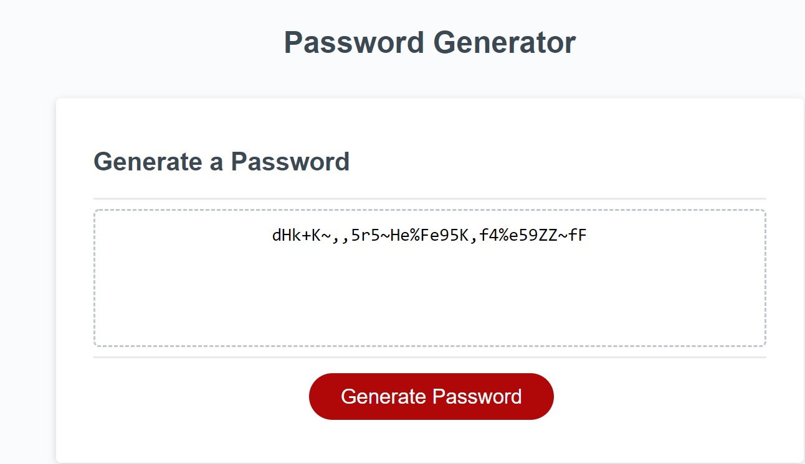

# Password Generator!

This application generates a random password of specified length based on user-defined criteria. 
Application will run the browser and feature dynamically updated HTML and CSS powered by JavaScript code for password generation.

# Steps to generate the password
 1. Navigate to [https://garimaggupta.github.io/hw3/](https://garimaggupta.github.io/hw3/) through web browser.
 2. Click on 'Generate Password' Button
 3. User will be prompted to enter the desired length of the password between 8 to 128 characters.
-- If user enters an invalid value, he will be prompted to enter valid value again 
4.  Next user will be prompted to select the password criteria. Users can select - Upper Case letters, Lower Case letters, Numbers and special characters () to be included in the password. 
-- At least one criteria is required. 
5. Based on criteria and length chosen in step 3 and 4, randomly generated password will be displayed in the text-box above the 'Generate Password' Button. Please refer to the screenshot below:

## Notes

_Passwords are generated using JavaScript local to the browser; passwords are neither requested nor transmitted_  
_Javascript code utilizes the Math.random() function to generate the random password_